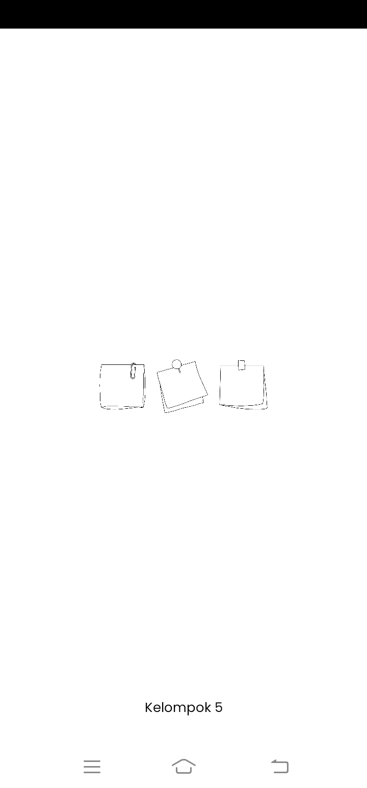
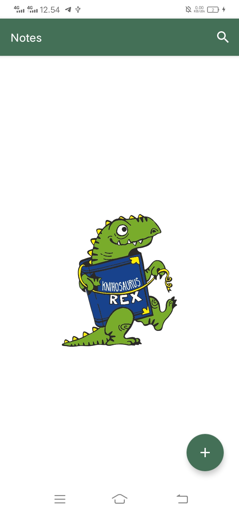
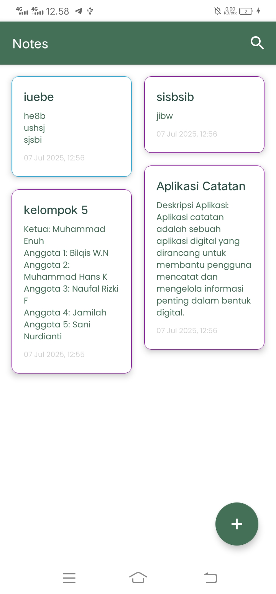
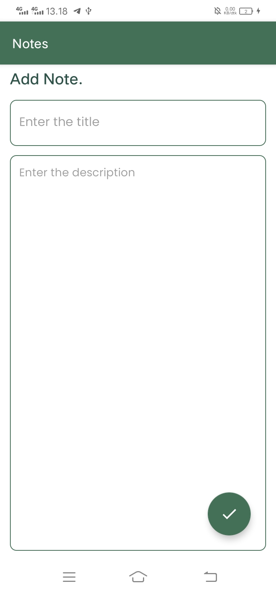
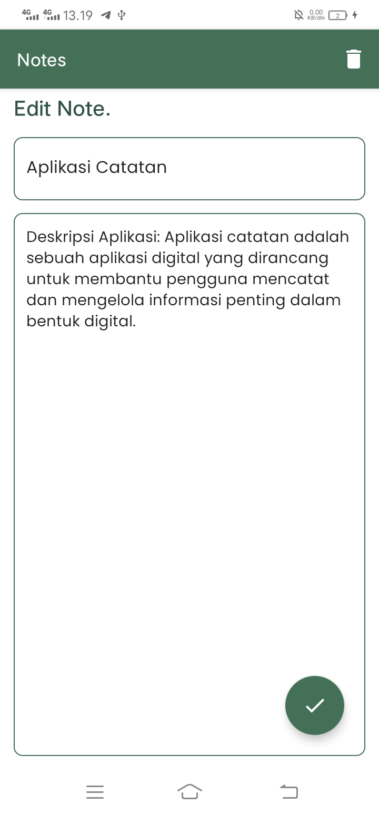
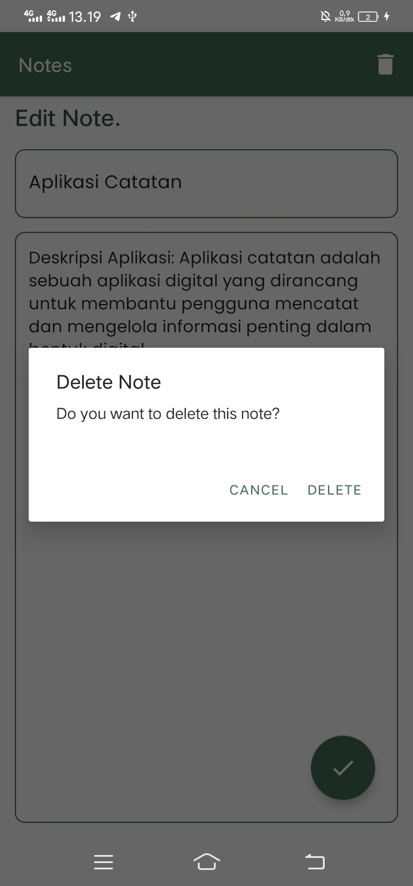

## 📱 K5N - Aplikasi Catatan Android

Aplikasi **pencatatan sederhana** berbasis Android yang dibuat oleh **Kelompok 5**. Proyek ini menggunakan **Kotlin**, **Room Database**, **ViewModel**, serta menambahkan **Splash Screen** buatan sendiri agar mendukung API rendah.

---

## 🚀 Fitur

- ✅ Tambah, ubah, dan hapus catatan
- ✅ Tampilan modern menggunakan Material Design
- ✅ Penyimpanan data lokal dengan Room
- ✅ Splash screen custom dengan logo dan nama kelompok
- ✅ Dukungan dark mode

---

## 🛠️ Teknologi

- Kotlin
- Room Database
- ViewModel & LiveData
- Navigation Component
- Material Components
- SplashScreen API (manual, support minSdk 21+)

---

## ▶️ Cara Menjalankan Proyek

1. **Clone repository ini:**
   ```bash
   git clone https://github.com/usernamenuh/AplikasiCatatan.git
   ```
2. **Buka folder proyek di Android Studio:**
   - Pilih menu `File > Open` lalu arahkan ke folder hasil clone.

3. **Sinkronisasi Gradle:**
   - Tunggu hingga proses sync selesai dan pastikan tidak ada error.

4. **Jalankan aplikasi:**
   - Pilih perangkat emulator atau device fisik.
   - Klik tombol `Run` (ikon ▶️) di Android Studio.

5. **Selesai!**
   - Aplikasi siap digunakan di perangkat Anda.

---

## 📸 Dokumentasi Aplikasi

Berikut beberapa tampilan aplikasi:

- **Splash Screen**  
  

- **Home (Jika Tidak Ada Catatan)**  
  

- **Home (Jika Ada Catatan)**  
  

- **Tambah Catatan**  
  

- **Edit Catatan**  
  

- **Hapus Catatan**  
  